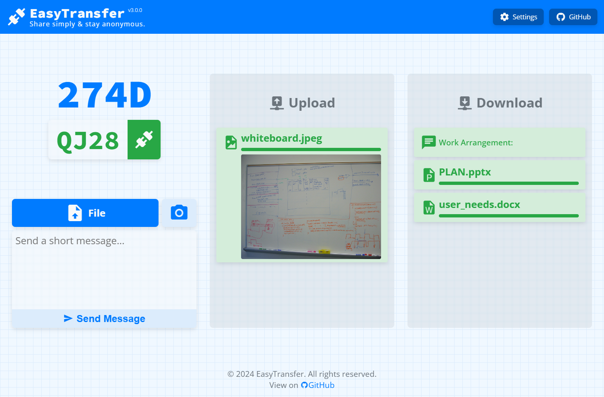

# EasyTransfer - Share simply & stay anonymous

 

[简体中文](README-ZH_cn.md) | English

**👉EXPERIENCE NOW: [EasyTransfer](https://file.ch3nyang.top/)**



EasyTransfer is a free, anonymous, encrypted, and easy-to-use E2EE file transfer tool. You only need to visit a simple web page to connect to **any device** in **any network** using a device code.

It is built using webRTC and Vue.js, and there is

- **NO** need to install any software
- **NO** need to register an account
- **NO** need to scan QR codes
- **NO** need to share URL links
- **NO** need to upload files to the server[^1]
- **NO** need to worry about the network environment

## How to use

1. Visit [EasyTransfer](https://file.ch3nyang.top/) on the two devices where you need to transfer files.
2. Enter the four-digit device code of any device into the device code input box of the other device and click the connect button.
3. After waiting for the connection to succeed, you can drag and drop the file to the file area on the web page, or click the file area to select the file. Supports sending multiple files at once.
4. In the settings, you can customize the STUN server and TURN server, or specify the maximum number of connections.

## Notes

- This project is hosted on a free server. Please do not abuse it.

## Self-deployment

1. [Fork](https://github.com/WCY-dt/EasyTransfer/fork) this project.

2. Import the entire project into [glitch](https://glitch.com/) or your own server.

    [](https://glitch.com/edit/#!/import/github/WCY-dt/EasyTransfer)

    > This project also provides an automated deployment script. You only need to create a new project in Glitch and run the following command in the project's console:
    >
    > ```shell
    > git config receive.denyCurrentBranch ignore
    > ```
    >
    > Then set Secrets `GLITCH_GIT_URL` in GitHub to the Git URL of your Glitch project.
    >
    > Whenever you push code to the `main` branch, GitHub Actions will automatically synchronize the code to the Glitch project.

3. Modify `signalServerUrl` and `iceServers` in [`./client/src/stores/connect.js`](https://github.com/WCY-dt/EasyTransfer/blob/main/client/src/stores/connect.js) to your own addresses if needed.

4. Open GitHub Pages and select the `gh-pages` branch as the source.

## TODO

- [x] Support large file transmission
- [x] Optimize transmission speed
- [x] Support photo transmission
- [x] Support plain text transmission
- [x] Support breakpoint resume

## Acknowledgements

- Thanks to [metered](https://www.metered.ca/) for providing free STUN and TURN servers.
- Thanks to [glitch](https://glitch.com/) for providing free signaling servers.

[^1]: If the communicating peers need to penetrate the intranet, the file may be uploaded to the free TURN server provided by this project. You can avoid this by deploying a trusted TURN server yourself.
